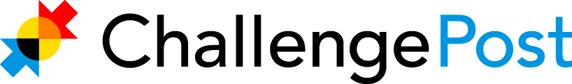

## Be a ChallengePost College Rep!

At ChallengePost, developers can compete in software challenges, showcase their work to the community, and draw inspiration from their peers.

We've powered online challenges and hackathons for organizations like the [White House](http://appsforhealthykids.challengepost.com?utm_source=github&utm_medium=referral&utm_campaign=collegerep), [Samsung](http://freethetv.challengepost.com/submissions?utm_source=github&utm_medium=referral&utm_campaign=collegerep), [Evernote](http://evernotedevcup.challengepost.com?utm_source=github&utm_medium=referral&utm_campaign=collegerep), [Ford](http://ford.challengepost.com/submissions?utm_source=github&utm_medium=referral&utm_campaign=collegerep), and [hundreds more](http://challengepost.com/discover?utm_source=github&utm_medium=referral&utm_campaign=collegerep). Our community is over 400,000 strong and growing!

### What's in it for you:

**Experience**

You'll be working with an agile New York based startup. We research, design, and iterate - it's the only way we know how to live. You'll gain exposure to our partners, loads of different technologies, and company culture. 

And if you ever have a question about Rails, marketing, product design, or running a record label - you've got an in house team of experts.

**A voice**

ChallengePost is a transparent and inclusive environment. Got an idea? Speak up and you will be heard.

**Swag**

Shirts, stickers, buttons, and tons of other stuff. We'll make sure you have everything you need to promote ChallengePost.

### What you'll be doing:

**Promoting and driving submissions to our awesome challenges**

As our 'boots on the ground', you'll help educate your peers about new challenges on ChallengePost, encourage them to sign up for our newsletters, and get the hyped up to participate!

**Representing ChallengePost at hackathons.**

ChallengePost loves hackathons, so much in fact that we power them for **free**. We're hoping you can attend hackathons and help the organizers get the most out of the product. Don't worry - we'll make sure you know EVERYTHING about it! We also want you to talk to potential hackathon organizers about using ChallengePost and potentially organize your own.

### What it takes:

This is a new path for us and we hope you'll help us shape it. As a baseline, we think you should be prepared to commit about 4 hours each week.

We'll ask you check in every week via email letting us know what you've been able to do that week and how we can help you get the word out even more. If you want to call or setup a Hangout, we're into that too!

Lastly, it's really important that you want to do this and view it as a mutual commitment. We're going to be team members after all!

### How to get started: 

Sign up [here](http://challengepost.us2.list-manage1.com/subscribe?u=4812d3b2b48f57c38070d62e7&id=6cbf05b996) and we'll get in touch -- or for extra credit:

1. Fork this repo.
2. Add a short markdown file telling us a bit about yourself, including where you go to school and something cool you've worked on recently. 
3. Submit a pull request!
